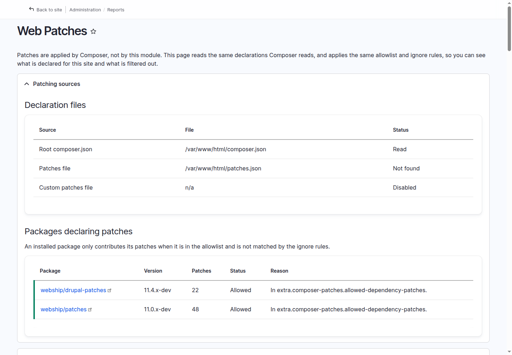
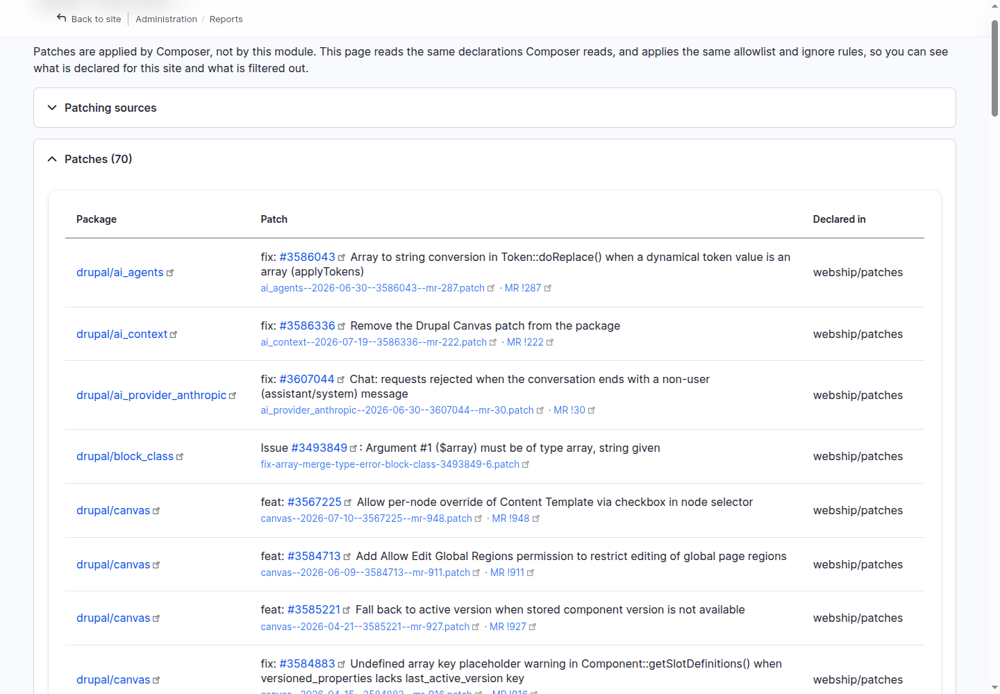

# The report

**Reports → Web Patches** (`/admin/reports/webpatches`, permission
*View the Web Patches report*) is one page with four parts, top to bottom.

## Patching sources

Two tables:

- **Declaration files** — each file the report reads (the root
  `composer.json`, the Composer Patches patches file, the optional custom
  file), with its path and whether it was read, not found, or disabled.
- **Packages declaring patches** — every installed package that carries
  `extra.patches`, with its version, how many patches it declares, and the
  allowlist verdict: **Allowed** or **Not allowed**, with the reason.

An installed package only contributes its patches when it matches
`extra.composer-patches.allowed-dependency-patches` and is not matched by the
ignore rules. A module that ships its own patches — the
[AI Context](https://www.drupal.org/project/ai_context) module has declared a
Drupal Canvas patch in its own `composer.json`, for example — shows up here as
*Not allowed* unless the site allowlists it, and its patch is never applied.

## The patch lock

Composer Patches v2 resolves the declarations into `patches.lock.json` and
applies from that lock, so the report compares the two on every load:

- **In sync** — a status line with the patch count.
- **Missing** — a warning that the lock does not exist (normal on Composer
  Patches v1, which keeps no lock file).
- **Out of sync** — the differences listed both ways: *declared but not in
  the lock*, and *in the lock but no longer declared* — with the composer
  command that re-resolves it.

The comparison always uses the full declared set; the *only installed
packages* display filter never affects it.

## Patches

Every declared patch, fully linked:

| Link | Where it goes |
| --- | --- |
| The package | its drupal.org project page (`drupal/core` maps to the `drupal` project; non-Drupal packages go to Packagist) |
| The `#1234567` in the description | the drupal.org issue |
| The patch file name | the patch file itself |
| **MR !id** | the merge request on git.drupalcode.org, when the file name carries `--mr-<id>` |

The **Declared in** column names the source: a declaration file, or the
dependency package that contributed the patch.

## Ignored patches

Every declared patch that is *not* applied, with the reason: the declaring
package is not in the allowlist, it is matched by
`extra.composer-patches.ignore-dependency-patches`, or the patch URL is listed
in `extra.patches-ignore`.

By default the report lists only patches for packages installed on the site —
a note at the bottom says so and links to the
[settings](configuration.md).
